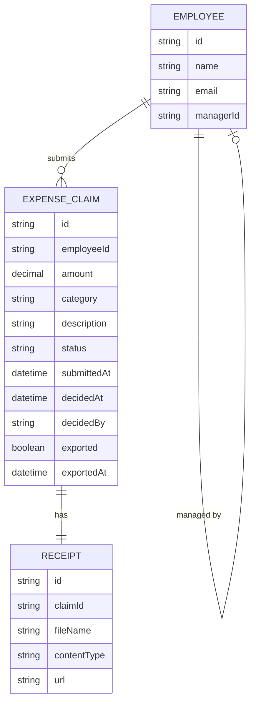

# Domain Model

The system tracks expense claims submitted by employees, decided by their
manager, and exported by finance for payroll.

- **EMPLOYEE** is every user of the system; `managerId` points at the
employee's own manager, forming the one-manager approval chain. A user with
no `managerId` has no manager (e.g. finance/top of the chain).
- **EXPENSE\_CLAIM** carries `status` (`pending`, `approved`, `rejected`) and,
once approved, `exported`/`exportedAt` so an export never includes the same
claim twice.
- **RECEIPT** is the attachment supporting one claim.

