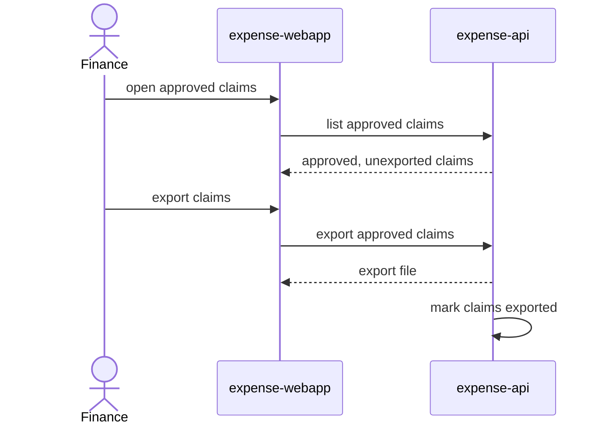

# Export approved claims to payroll

Finance reviews every approved claim and exports the ones payroll has not
yet received, so an export is never duplicated.

```mermaid
sequenceDiagram
    actor Finance
    participant expenseweb as expense-webapp
    participant expenseapi as expense-api

    Finance->>expenseweb: open approved claims
    expenseweb->>expenseapi: list approved claims
    expenseapi-->>expenseweb: approved, unexported claims

    Finance->>expenseweb: export claims
    expenseweb->>expenseapi: export approved claims
    expenseapi-->>expenseweb: export file
    expenseapi->>expenseapi: mark claims exported
```

