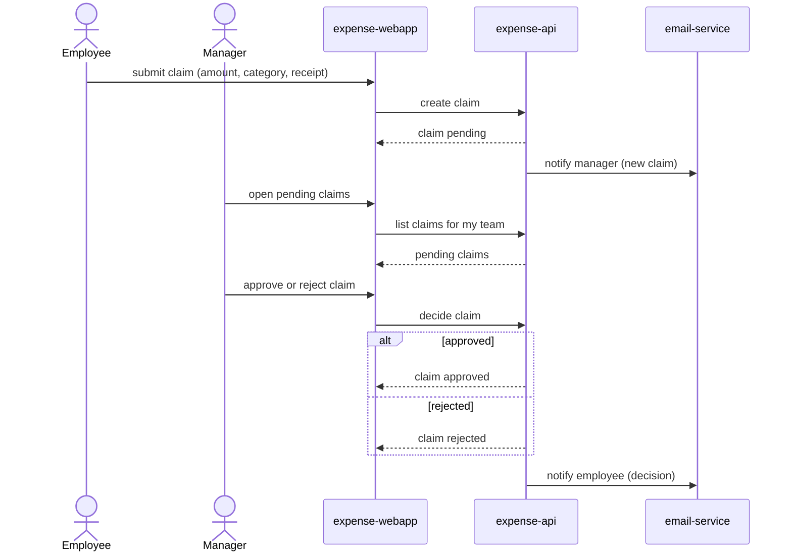

# Submit and approve a claim

An Employee submits an expense claim; their Manager reviews it and decides,
and both are notified as the status changes.

```mermaid
sequenceDiagram
    actor Employee
    actor Manager
    participant expenseweb as expense-webapp
    participant expenseapi as expense-api
    participant email as email-service

    Employee->>expenseweb: submit claim (amount, category, receipt)
    expenseweb->>expenseapi: create claim
    expenseapi-->>expenseweb: claim pending
    expenseapi->>email: notify manager (new claim)

    Manager->>expenseweb: open pending claims
    expenseweb->>expenseapi: list claims for my team
    expenseapi-->>expenseweb: pending claims

    Manager->>expenseweb: approve or reject claim
    expenseweb->>expenseapi: decide claim
    alt approved
        expenseapi-->>expenseweb: claim approved
    else rejected
        expenseapi-->>expenseweb: claim rejected
    end
    expenseapi->>email: notify employee (decision)
```

